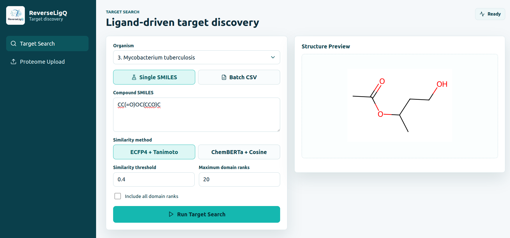
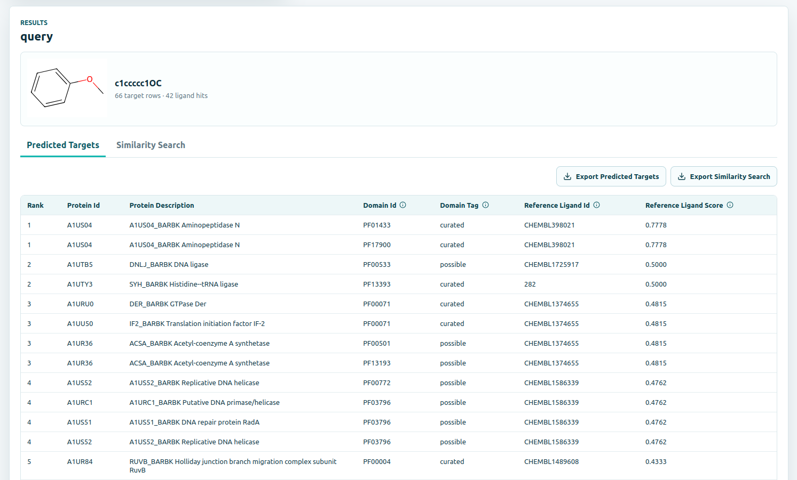
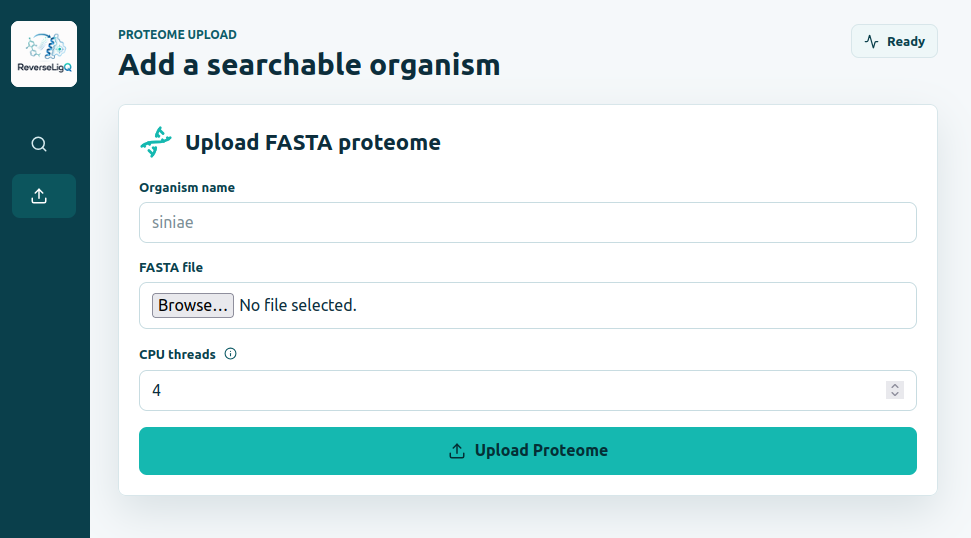

# ReverseLigQ - Ligand-Driven Protein Target Discovery

**ReverseLigQ** predicts candidate protein targets for a query ligand. It searches
for chemically similar compounds with known protein-domain evidence and reports
compatible protein/domain targets for built-in organisms or user-uploaded
proteomes.

The easiest way to use ReverseLigQ is the **Graphical Frontend**. It lets users
run target searches, inspect molecule structures, upload proteomes, and export
result tables without using the command line after startup.

Public datasets are downloaded automatically when needed and are stored under
`databases/`.

---

## Contents

- [Quick Start](#quick-start)
- [Graphical Frontend Preview](#graphical-frontend-preview)
- [Using the Graphical Frontend](#using-the-graphical-frontend)
- [Input Files](#input-files)
- [Result Tables](#result-tables)
- [Built-in Organisms](#built-in-organisms)
- [Command Line Usage](#command-line-usage)
- [Docker CLI Usage](#docker-cli-usage)
- [Data Storage and Persistence](#data-storage-and-persistence)
- [Troubleshooting](#troubleshooting)
- [Citation](#citation)

---

## Quick Start

### Option 1: Graphical Frontend with Docker (recommended)

This is the simplest option for most users. Docker runs the full application and
keeps downloaded databases and uploaded proteomes in persistent volumes.

Clone the repository:

```bash
git clone https://github.com/gschottlender/ReverseLigQ.git
cd ReverseLigQ
```

Build the image:

```bash
docker build -t gschottlender/reverseligq:latest .
```

Create persistent volumes once:

```bash
docker volume create reverse_ligq_db
docker volume create reverse_ligq_hf_cache
```

Run the frontend:

```bash
docker run --rm \
  -p 8000:8000 \
  -v reverse_ligq_db:/app/databases \
  -v reverse_ligq_hf_cache:/hf_cache \
  gschottlender/reverseligq:latest
```

Open:

```text
http://127.0.0.1:8000/
```

If port `8000` is already in use, run:

```bash
docker run --rm \
  -p 8001:8000 \
  -v reverse_ligq_db:/app/databases \
  -v reverse_ligq_hf_cache:/hf_cache \
  gschottlender/reverseligq:latest
```

Then open:

```text
http://127.0.0.1:8001/
```

To stop the container, press `Ctrl+C` in the terminal running Docker.

### Option 2: Local Graphical Frontend for Development

Use this option if you want to modify the frontend or backend code locally.

Create and activate the conda environment:

```bash
conda env create -n reverse_ligq -f environment.yml
conda activate reverse_ligq
```

If you already created the environment with another name, activate that
environment instead.

Start the backend in one terminal:

```bash
uvicorn web.backend.app:app --reload --host 127.0.0.1 --port 8000
```

Start the frontend in a second terminal:

```bash
cd web/frontend
npm install
npm run dev
```

Open the URL shown by Vite, usually:

```text
http://127.0.0.1:5173/
```

To stop the local frontend, press `Ctrl+C` in both terminals:

- the backend terminal running `uvicorn`,
- the frontend terminal running `npm run dev`.

---

## Graphical Frontend Preview

Representative screenshots using example inputs.

### Target Search



### Search Results



### Proteome Upload



---

## Using the Graphical Frontend

### Target Search

Use this screen to evaluate one ligand or a CSV batch.

1. Select an organism from the dropdown.
2. Enter one SMILES string or upload a CSV file.
3. Choose a similarity method:
   - `ECFP4 + Tanimoto`
   - `ChemBERTa + Cosine`
4. Set the similarity threshold:
   - default `0.4` for ECFP4/Tanimoto
   - default `0.85` for ChemBERTa/Cosine in the frontend
5. Set the maximum number of domain ranks to keep, or include all ranks.
6. Click **Run Target Search**.

After the run finishes, the frontend shows one result section per ligand. The
default tab is `Predicted Targets`; the second tab is `Similarity Search`. Both
tables can be exported as CSV files.

### Proteome Upload

Use this screen to add a new organism.

1. Enter a short organism name, for example `siniae`.
2. Upload a protein FASTA file.
3. Choose the number of CPUs for HMMER.
4. Click **Upload Proteome**.

If the upload succeeds, the organism becomes available in the Target Search
organism dropdown. With Docker, this remains available across restarts as long
as you keep using the same `reverse_ligq_db` volume.

Proteome upload uses HMMER/Pfam with Pfam gathering thresholds
(`hmmscan --cut_ga`) to avoid strong over-annotation relative to Pfam/UniProt.

---

## Input Files

### Single SMILES

Example:

```text
CC(=O)OC1=CC=CC=C1C(=O)O
```

### Batch CSV

Batch input must contain these columns:

- `lig_id`: your ligand identifier
- `smiles`: ligand SMILES

Example:

```csv
lig_id,smiles
aspirin,CC(=O)OC1=CC=CC=C1C(=O)O
caffeine,CN1C(=O)N(C)c2ncn(C)c2C1=O
ibuprofen,CC(C)CC1=CC=C(C=C1)C(C)C(=O)O
```

An example file is included at `example_queries.csv`.

### Proteome FASTA

Proteome uploads require a protein FASTA file. Use a short organism name without
spaces or special characters. Letters, numbers, hyphens, and underscores are the
safest choices.

---

## Result Tables

ReverseLigQ writes two CSV tables for every ligand.

### `predicted_targets.csv`

Candidate protein targets with domain evidence and reference ligand scores.
Important columns include:

- `rank`
- `protein_id`
- `protein_description`
- `domain_id`
- `domain_tag`
- `reference_ligand_id`
- `reference_ligand_score`

`domain_tag` indicates the evidence type:

- `curated`: the reference ligand has experimentally confirmed domain evidence.
- `possible`: the reference ligand binds a multi-domain protein, but the exact
  binding domain is not resolved.

In the Graphical Frontend, `protein_id` values from built-in organisms link to a
UniProt search for that identifier. Uploaded proteomes keep protein identifiers
as plain text because their IDs may not be UniProt accessions. `domain_id`
values link to the corresponding InterPro Pfam entry.

### `similarity_search_results.csv`

Ligands similar to the query compound, together with their scores and associated
domain summaries. Important columns include:

- `rank`
- `comp_id`
- `score`
- `smiles`
- `curated_domains`
- `possible_domains`
- `domain_summary`

An empty result table is a valid outcome. It means no ligand/domain candidates
passed the selected similarity threshold and filters.

---

## Built-in Organisms

Each built-in organism is referenced by an integer key in CLI mode. In the
Graphical Frontend, choose it from the organism dropdown.

| Key | Organism |
|---:|:--|
| 1 | *Bartonella bacilliformis* |
| 2 | *Klebsiella pneumoniae* |
| 3 | *Mycobacterium tuberculosis* |
| 4 | *Trypanosoma cruzi* |
| 5 | *Staphylococcus aureus* RF122 |
| 6 | *Streptococcus uberis* 0140J |
| 7 | *Enterococcus faecium* |
| 8 | *Escherichia coli* MG1655 |
| 9 | *Streptococcus agalactiae* NEM316 |
| 10 | *Pseudomonas syringae* |
| 11 | DENV (Dengue virus) |
| 12 | SARS-CoV-2 |
| 13 | *Homo sapiens* |

---

## Command Line Usage

The command line is useful for scripted runs and large batches.

### Installation

```bash
git clone https://github.com/gschottlender/ReverseLigQ.git
cd ReverseLigQ
conda env create -n reverse_ligq -f environment.yml
conda activate reverse_ligq
```

### Single-ligand Search

```bash
python rev_ligq.py \
  --organism 13 \
  --query-smiles "CC(=O)OC1=CC=CC=C1C(=O)O" \
  --min-score 0.35 \
  --max-domain-ranks 20 \
  --out-dir results
```

### Batch Search

```bash
python rev_ligq.py \
  --organism 13 \
  --query-csv example_queries.csv \
  --min-score 0.4 \
  --max-domain-ranks 20 \
  --out-dir results
```

For each ligand, outputs are written to:

```text
results/<lig_id>/
  predicted_targets.csv
  similarity_search_results.csv
```

### ChemBERTa Search

```bash
python rev_ligq.py \
  --organism 13 \
  --query-smiles "CC(=O)OC1=CC=CC=C1C(=O)O" \
  --search-type chemberta \
  --min-score 0.85 \
  --out-dir results
```

CLI defaults are `0.4` for ECFP4/Tanimoto and `0.8` for ChemBERTa/Cosine if
`--min-score` is omitted.

### Common Arguments

- `--organism`: built-in organism key, or uploaded organism name with
  `--uploaded-organism`.
- `--query-smiles`: one SMILES query.
- `--query-csv`: CSV batch file with `lig_id,smiles`.
- `--search-type`: `morgan_fp_tanimoto` or `chemberta`.
- `--min-score`: similarity threshold.
- `--max-domain-ranks`: maximum number of domain ranks in the final target
  table. Use `none` to keep all domain ranks.
- `--k-max-ligands`: maximum ligand hits kept after thresholding. Default:
  `1000`.
- `--out-dir`: output directory. Default: `results/`.
- `--chunk-size`: streaming chunk size for ligand scans. Default: `50000`.

### Upload a New Proteome

```bash
python upload_proteome.py \
  --org-name siniae \
  --fasta-path ./streptococcus_iniae_proteome.fasta \
  --cpu 4
```

Generated local organism files are stored under:

```text
databases/local_organism_data/<org_name>/
  domain_to_proteins.pkl
  lig_list.pkl
  prot_descriptions.pkl
```

### Search an Uploaded Organism

```bash
python rev_ligq.py \
  --organism siniae \
  --uploaded-organism \
  --query-smiles "CC(=O)OC1=CC=CC=C1C(=O)O" \
  --out-dir results
```

---

## Docker CLI Usage

The Docker image starts the Graphical Frontend by default. For command-line
searches through Docker, override the command with `python rev_ligq.py` or
`python upload_proteome.py`.

### Single-ligand Search

```bash
mkdir -p results

docker run --rm \
  -v reverse_ligq_db:/app/databases \
  -v reverse_ligq_hf_cache:/hf_cache \
  -v "$PWD/results":/app/results \
  gschottlender/reverseligq:latest \
  python rev_ligq.py \
    --organism 13 \
    --query-smiles "CC(=O)OC1=CC=CC=C1C(=O)O" \
    --min-score 0.35 \
    --max-domain-ranks 20 \
    --out-dir /app/results
```

### Batch Search

```bash
mkdir -p results

docker run --rm \
  -v reverse_ligq_db:/app/databases \
  -v reverse_ligq_hf_cache:/hf_cache \
  -v "$PWD/example_queries.csv":/app/example_queries.csv \
  -v "$PWD/results":/app/results \
  gschottlender/reverseligq:latest \
  python rev_ligq.py \
    --organism 13 \
    --query-csv /app/example_queries.csv \
    --min-score 0.4 \
    --max-domain-ranks 20 \
    --out-dir /app/results
```

### Upload a Proteome

Run this from the folder that contains the FASTA file:

```bash
docker run --rm \
  -v reverse_ligq_db:/app/databases \
  -v "$PWD":/data \
  gschottlender/reverseligq:latest \
  python upload_proteome.py \
    --org-name siniae \
    --fasta-path /data/streptococcus_iniae_proteome.fasta \
    --cpu 4
```

### Search an Uploaded Organism

```bash
mkdir -p results

docker run --rm \
  -v reverse_ligq_db:/app/databases \
  -v reverse_ligq_hf_cache:/hf_cache \
  -v "$PWD/results":/app/results \
  gschottlender/reverseligq:latest \
  python rev_ligq.py \
    --organism siniae \
    --uploaded-organism \
    --query-smiles "CC(=O)OC1=CC=CC=C1C(=O)O" \
    --out-dir /app/results
```

---

## Data Storage and Persistence

### Local Runs

ReverseLigQ stores downloaded data and uploaded organisms under `databases/`.

```text
databases/
  compound_data/
  merged_databases/
  rev_ligq/
  local_organism_data/
```

The first run downloads the public dataset automatically if it is missing.

### Docker Runs

The recommended Docker command mounts:

- `reverse_ligq_db` at `/app/databases`
- `reverse_ligq_hf_cache` at `/hf_cache`

`reverse_ligq_db` stores downloaded databases, Pfam files, and uploaded
proteomes. Uploaded organisms remain available after the container stops as long
as you reuse this same volume.

To remove all stored Docker data:

```bash
docker volume rm reverse_ligq_db
docker volume rm reverse_ligq_hf_cache
```

This deletes downloaded databases, uploaded proteomes, and cached ChemBERTa
files. It does not delete result folders that were written to your local
filesystem.

---

## Updating or Rebuilding the Dataset

`update_rev_ligq.py` rebuilds ReverseLigQ artifacts from upstream data sources.
Most users do not need to run it.

Typical usage:

```bash
python update_rev_ligq.py --chembl-version 37 --output-dir databases
```

---

## Troubleshooting

### The browser cannot access the frontend

Check that the Docker container or local backend/frontend terminals are still
running. If port `8000` is busy, map a different host port:

```bash
docker run --rm \
  -p 8001:8000 \
  -v reverse_ligq_db:/app/databases \
  -v reverse_ligq_hf_cache:/hf_cache \
  gschottlender/reverseligq:latest
```

Then open `http://127.0.0.1:8001/`.

### A search returns no targets

This is not necessarily an error. It means no ligand/domain candidates passed
the selected threshold and filters. Try lowering the similarity threshold or
including more domain ranks.

### Uploaded organisms disappear in Docker

Make sure every run uses the same database volume:

```bash
-v reverse_ligq_db:/app/databases
```

If you run Docker without this volume, uploaded proteomes are not persisted.

### Proteome upload is slow

Proteome upload runs HMMER/Pfam over the FASTA file. Large proteomes can take a
long time. Increase `--cpu` if more CPU cores are available.

---

## Citation

If you use ReverseLigQ or its datasets, please cite:

Schottlender G, Prieto JM, Palumbo MC, Castello FA, Serral F, Sosa EJ, Turjanski
AG, Martí MA and Fernández Do Porto D (2022). *From drugs to targets: Reverse
engineering the virtual screening process on a proteomic scale.* Frontiers in
Drug Discovery 2:969983. doi: [10.3389/fddsv.2022.969983](https://doi.org/10.3389/fddsv.2022.969983)

#### Archived software release:

ReverseLigQ v1.0.0.
https://doi.org/10.5281/zenodo.21340238